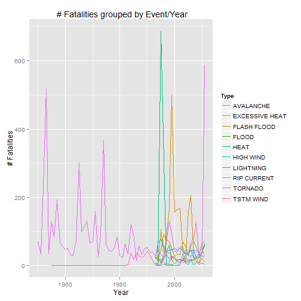
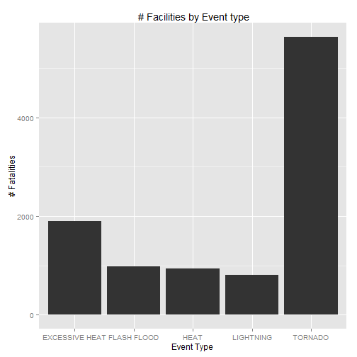
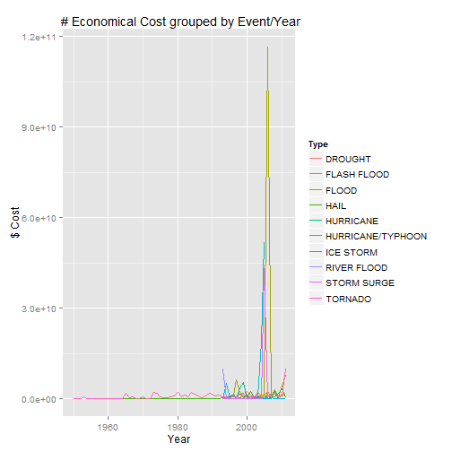

# XRDS BLOG: R software and tools for everyday use - Sample 1

Storm Data Analysis: population health and economical consequences.
==============================================================================

# Synopsis

That document analyzes the last 50 years data from the U.S. National Oceanic and Atmospheric Administration's (NOAA) storm database.
The document focused the analisis determining which types of events  are most harmful with respect to population health and which types of events have the greatest economic consequences.


# Data Processing

1.- Data From csv must be readed and loades into the 'data' variable. 

```r
data <- read.csv("repdata-data-StormData.csv.bz2")
```
The interesting fields from that data are:
* EVTYPE describes the event
* FATALITIES  descrives the # of fatalities
* PROPDMGEXP  describes a magnitude
* CROPDMGEXP  describes a magnitude
* PROPDMG   describes the main economical cost of the consequences
* CROPDMG   describes others economical cost


Once the data is readed, some modifications on that data have to be done:
* convert 'BGN_DATE' the with is a date field into a Date Object. later this conversion will be used to plot some information. 


```r
  data$BGN_DATE <- as.Date(data$BGN_DATE, "%m/%d/%Y")
  data$Year<-format(data$BGN_DATE,"%Y")
```
* harmonize EVTYPE in order to get better and more real results

```r
data$EVTYPE <- toupper(data$EVTYPE)
data$EVTYPE <- as.factor(data$EVTYPE)
```
* harmonize economical data in order to get the real economical cost

```r
#main economical cost
data$PROPDMGEXP<- toupper(data$PROPDMGEXP)
data$PROPDMGEXP <- as.factor(data$PROPDMGEXP)
#other economical cost
data$CROPDMGEXP<- toupper(data$CROPDMGEXP)
data$CROPDMGEXP <- as.factor(data$CROPDMGEXP)
#get final economical value

data$ECO[data$PROPDMGEXP == "K"] <- data$PROPDMG[data$PROPDMGEXP == "K"] * 1000
data$ECO[data$PROPDMGEXP == "M"] <- data$PROPDMG[data$PROPDMGEXP == "M"] * 1000000
data$ECO[data$PROPDMGEXP == "B"] <- data$PROPDMG[data$PROPDMGEXP == "B"] * 1000000000

data$ECO2[data$CROPDMGEXP == "K" ] <- data$CROPDMG[data$CROPDMGEXP == "K"] * 1000
data$ECO2[data$CROPDMGEXP == "M"] <- data$CROPDMG[data$CROPDMGEXP == "M"] * 1000000
data$ECO2[data$CROPDMGEXP == "B"] <- data$CROPDMG[data$CROPDMGEXP == "B"] * 1000000000

#replace NA with 0 on OLD events without that information

y1 <- which(is.na(data$ECO))         # get index of NA values
y2 <- which(is.na(data$ECO2))         # get index of NA values

data$ECO[y1] <-0
data$ECO2[y2] <-0

#get the total economical cost
data$ECOT<-data$ECO +data$ECO2
```

Now, that analisys answers the proposed questions:
* Get the total facilities by Event type
* Get the Total Economical cost by Event

### Processing data for getting the Total Facilities by Event type


```r
#fatalities per type
fatalitiesXType=aggregate(data$FATALITIES, by=list(data$EVTYPE), sum)
#change columns names
colnames(fatalitiesXType)<-c("Type","Sum")
#grouping fatalities by year and event type
fatalitiesXTypeYear=aggregate(data$FATALITIES, by=list(data$EVTYPE,as.numeric(data$Year)), sum)
#change columns names
colnames(fatalitiesXTypeYear)<-c("Type","Year","Sum")


##contains the most harmful fatality
mharmful<-fatalitiesXType[which.max(fatalitiesXType$Sum),]

#Order the facilities by type for easy plotting
#get facilities by type ordered, used for plotting
orderFatalitiesindex<-order(fatalitiesXType$Sum, decreasing=TRUE)
orderFatalities<-fatalitiesXType[orderFatalitiesindex,]
most10<-head(orderFatalities,10)
most5<-head(orderFatalities,5)
```

With that processed data, the most harmful event is TORNADO, 5633.  

### Processing data for getting the Total Economical cost by Event


```r
#grouping economical cost by year and event type
costXTypeYear=aggregate(data$ECOT, by=list(data$EVTYPE,as.numeric(data$Year)), sum)
#change columns names
colnames(costXTypeYear)<-c("Type","Year","Sum")

#summarize events economical injuries
injuriesEco <- aggregate(data$ECOT,list(event = data$EVTYPE), sum)
colnames(injuriesEco)<-c("Type","Sum")
mcost<-injuriesEco[which.max(injuriesEco$Sum),]

#get injuries by ECo ordered, used for plotting
orderECOindex<-order(injuriesEco$Sum, decreasing=TRUE)
orderECO<-injuriesEco[orderECOindex,]
most10eco<-head(orderECO,10)
```

With that processed data, the worst economical efect is FLOOD, 1.5032 &times; 10<sup>11</sup>.


# Results


With that processed data, the most harmful event is TORNADO, 5633. 
The top 10 most harmful events are:

```r
print(most10)
```

```
##               Type  Sum
## 758        TORNADO 5633
## 116 EXCESSIVE HEAT 1903
## 138    FLASH FLOOD  978
## 243           HEAT  937
## 418      LIGHTNING  816
## 779      TSTM WIND  504
## 154          FLOOD  470
## 524    RIP CURRENT  368
## 320      HIGH WIND  248
## 19       AVALANCHE  224
```

Plotting the evolution of the fatalities grouped by Event.

```r
library(ggplot2)
```

```
## Warning: package 'ggplot2' was built under R version 3.1.1
```

```r
ggplot(aes(x = Year, y = Sum, colour = Type), data = fatalitiesXTypeYear[fatalitiesXTypeYear$Type %in% most10$Type,]) + geom_line() + scale_y_continuous(name = "# Fatalities") +ggtitle(" # Fatalities grouped by Event/Year")
```

 

Plotting and Histogram of # Facilities by Event type

```r
ggplot(fatalitiesXTypeYear[fatalitiesXTypeYear$Type %in% most5$Type,],aes(x=Type,y=Sum)) + geom_bar(stat="identity")+xlab("Event Type") + ylab("# Fatalities") +ggtitle(" # Facilities by Event type")
```

 

With that processed data, the worst economical efect is FLOOD, 1.5032 &times; 10<sup>11</sup>.

```r
print(most10eco)
```

```
##                  Type       Sum
## 154             FLOOD 1.503e+11
## 372 HURRICANE/TYPHOON 7.191e+10
## 758           TORNADO 5.735e+10
## 599       STORM SURGE 4.332e+10
## 212              HAIL 1.876e+10
## 138       FLASH FLOOD 1.756e+10
## 84            DROUGHT 1.502e+10
## 363         HURRICANE 1.461e+10
## 529       RIVER FLOOD 1.015e+10
## 387         ICE STORM 8.967e+09
```
Plotting the evolution of the economical cost grouped by Event.

```r
library(ggplot2)
ggplot(aes(x = Year, y = Sum, colour = Type), data = costXTypeYear[costXTypeYear$Type %in% most10eco$Type,]) + geom_line() + scale_y_continuous(name = "$ Cost") +ggtitle(" # Economical Cost grouped by Event/Year")
```

 
