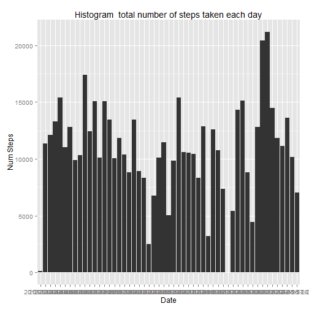
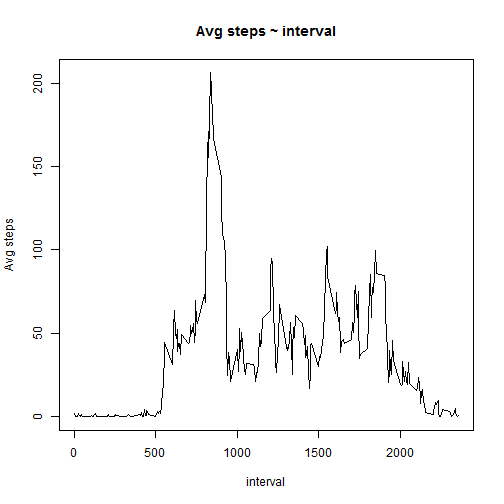
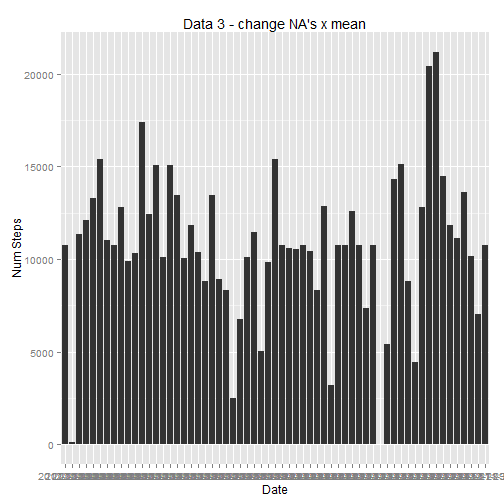
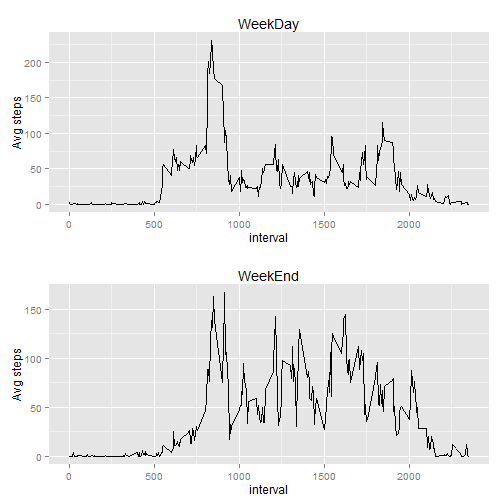

# XRDS BLOG: R software and tools for everyday use - Sample 2


## Loading and preprocessing the data

```r
data<-read.csv("activity.csv",header = TRUE, sep = ",")
```


## What is mean total number of steps taken per day?

```r
#omit NA values
data2<-data[complete.cases(data),]
sums<-aggregate(data2$steps, by=list(data2$date), FUN=sum,na.rm = FALSE)
#change columns names
colnames(sums)<-c("date","sum")
print(sums)
```

```
##          date   sum
## 1  2012-10-02   126
## 2  2012-10-03 11352
## 3  2012-10-04 12116
## 4  2012-10-05 13294
## 5  2012-10-06 15420
## 6  2012-10-07 11015
## 7  2012-10-09 12811
## 8  2012-10-10  9900
## 9  2012-10-11 10304
## 10 2012-10-12 17382
## 11 2012-10-13 12426
## 12 2012-10-14 15098
## 13 2012-10-15 10139
## 14 2012-10-16 15084
## 15 2012-10-17 13452
## 16 2012-10-18 10056
## 17 2012-10-19 11829
## 18 2012-10-20 10395
## 19 2012-10-21  8821
## 20 2012-10-22 13460
## 21 2012-10-23  8918
## 22 2012-10-24  8355
## 23 2012-10-25  2492
## 24 2012-10-26  6778
## 25 2012-10-27 10119
## 26 2012-10-28 11458
## 27 2012-10-29  5018
## 28 2012-10-30  9819
## 29 2012-10-31 15414
## 30 2012-11-02 10600
## 31 2012-11-03 10571
## 32 2012-11-05 10439
## 33 2012-11-06  8334
## 34 2012-11-07 12883
## 35 2012-11-08  3219
## 36 2012-11-11 12608
## 37 2012-11-12 10765
## 38 2012-11-13  7336
## 39 2012-11-15    41
## 40 2012-11-16  5441
## 41 2012-11-17 14339
## 42 2012-11-18 15110
## 43 2012-11-19  8841
## 44 2012-11-20  4472
## 45 2012-11-21 12787
## 46 2012-11-22 20427
## 47 2012-11-23 21194
## 48 2012-11-24 14478
## 49 2012-11-25 11834
## 50 2012-11-26 11162
## 51 2012-11-27 13646
## 52 2012-11-28 10183
## 53 2012-11-29  7047
```

```r
library(ggplot2)
```

```
## Warning: package 'ggplot2' was built under R version 3.1.1
```

```r
library(gridExtra) 
```

```
## Loading required package: grid
```

```r
#histogram
ggplot(sums,aes(x=date,y=sum)) + geom_bar(stat="identity") +xlab("Date") + ylab("Num Steps")+ggtitle("Histogram  total number of steps taken each day")
```

 

```r
#Calculate and report the mean total number of steps taken per day
smean<-aggregate(data2$steps, by=list(data2$date), FUN=mean)
colnames(smean)<-c("date","mean")
print(smean)
```

```
##          date    mean
## 1  2012-10-02  0.4375
## 2  2012-10-03 39.4167
## 3  2012-10-04 42.0694
## 4  2012-10-05 46.1597
## 5  2012-10-06 53.5417
## 6  2012-10-07 38.2465
## 7  2012-10-09 44.4826
## 8  2012-10-10 34.3750
## 9  2012-10-11 35.7778
## 10 2012-10-12 60.3542
## 11 2012-10-13 43.1458
## 12 2012-10-14 52.4236
## 13 2012-10-15 35.2049
## 14 2012-10-16 52.3750
## 15 2012-10-17 46.7083
## 16 2012-10-18 34.9167
## 17 2012-10-19 41.0729
## 18 2012-10-20 36.0938
## 19 2012-10-21 30.6285
## 20 2012-10-22 46.7361
## 21 2012-10-23 30.9653
## 22 2012-10-24 29.0104
## 23 2012-10-25  8.6528
## 24 2012-10-26 23.5347
## 25 2012-10-27 35.1354
## 26 2012-10-28 39.7847
## 27 2012-10-29 17.4236
## 28 2012-10-30 34.0938
## 29 2012-10-31 53.5208
## 30 2012-11-02 36.8056
## 31 2012-11-03 36.7049
## 32 2012-11-05 36.2465
## 33 2012-11-06 28.9375
## 34 2012-11-07 44.7326
## 35 2012-11-08 11.1771
## 36 2012-11-11 43.7778
## 37 2012-11-12 37.3785
## 38 2012-11-13 25.4722
## 39 2012-11-15  0.1424
## 40 2012-11-16 18.8924
## 41 2012-11-17 49.7882
## 42 2012-11-18 52.4653
## 43 2012-11-19 30.6979
## 44 2012-11-20 15.5278
## 45 2012-11-21 44.3993
## 46 2012-11-22 70.9271
## 47 2012-11-23 73.5903
## 48 2012-11-24 50.2708
## 49 2012-11-25 41.0903
## 50 2012-11-26 38.7569
## 51 2012-11-27 47.3819
## 52 2012-11-28 35.3576
## 53 2012-11-29 24.4688
```

```r
#Calculate and report the median total number of steps taken per day
smedian<-aggregate(data2$steps, by=list(data2$date), FUN=median)
colnames(smedian)<-c("date","median")
print(smedian)
```

```
##          date median
## 1  2012-10-02      0
## 2  2012-10-03      0
## 3  2012-10-04      0
## 4  2012-10-05      0
## 5  2012-10-06      0
## 6  2012-10-07      0
## 7  2012-10-09      0
## 8  2012-10-10      0
## 9  2012-10-11      0
## 10 2012-10-12      0
## 11 2012-10-13      0
## 12 2012-10-14      0
## 13 2012-10-15      0
## 14 2012-10-16      0
## 15 2012-10-17      0
## 16 2012-10-18      0
## 17 2012-10-19      0
## 18 2012-10-20      0
## 19 2012-10-21      0
## 20 2012-10-22      0
## 21 2012-10-23      0
## 22 2012-10-24      0
## 23 2012-10-25      0
## 24 2012-10-26      0
## 25 2012-10-27      0
## 26 2012-10-28      0
## 27 2012-10-29      0
## 28 2012-10-30      0
## 29 2012-10-31      0
## 30 2012-11-02      0
## 31 2012-11-03      0
## 32 2012-11-05      0
## 33 2012-11-06      0
## 34 2012-11-07      0
## 35 2012-11-08      0
## 36 2012-11-11      0
## 37 2012-11-12      0
## 38 2012-11-13      0
## 39 2012-11-15      0
## 40 2012-11-16      0
## 41 2012-11-17      0
## 42 2012-11-18      0
## 43 2012-11-19      0
## 44 2012-11-20      0
## 45 2012-11-21      0
## 46 2012-11-22      0
## 47 2012-11-23      0
## 48 2012-11-24      0
## 49 2012-11-25      0
## 50 2012-11-26      0
## 51 2012-11-27      0
## 52 2012-11-28      0
## 53 2012-11-29      0
```


## What is the average daily activity pattern?


```r
#calculate new mean for intervals
smean2<-aggregate(data2$steps, by=list(data2$interval), FUN=mean)
colnames(smean2)<-c("interval","mean")
plot(smean2$interval,smean2$mean,main="Avg steps ~ interval",xlab="interval",ylab="Avg steps",col="black",type="l")
```

 

```r
#Which 5-minute interval, on average across all the days in the dataset, 
#contains the maximum number of steps?
smean2[which.max(smean2$mean),]
```

```
##     interval  mean
## 104      835 206.2
```


## Imputing missing values

```r
#The NA values will be replaced by its interval mean value


#calculate rows with NA values
dataNA <- subset(data, is.na(data$steps))
emptyRows<-nrow(dataNA)
print(paste("Total columns with missing values",emptyRows))
```

```
## [1] "Total columns with missing values 2304"
```

```r
#Create a new dataset that is equal to the original dataset but with the missing data filled in.

data3<-data
y <- which(is.na(data3$steps))         # get index of NA values 

# replace all NA for its interval MEAN values 
data3$steps[y] <-smean2[ smean2$interval %in%  data3$interval[y],]$mean 


#create df for the new histogram
sumsData3<-aggregate(data3$steps, by=list(data3$date), FUN=sum,na.rm = FALSE)
#change the columns name
colnames(sumsData3)<-c("date","sum")

ggplot(sumsData3,aes(x=date,y=sum)) + geom_bar(stat="identity")+xlab("Date") + ylab("Num Steps") +ggtitle("Data 3 - change NA's x mean")
```

 

```r
#calculate df for new Mean
smeanData3<-aggregate(data3$steps, by=list(data3$date), FUN=mean)
colnames(smeanData3)<-c("date","mean")
print(smeanData3)
```

```
##          date    mean
## 1  2012-10-01 37.3826
## 2  2012-10-02  0.4375
## 3  2012-10-03 39.4167
## 4  2012-10-04 42.0694
## 5  2012-10-05 46.1597
## 6  2012-10-06 53.5417
## 7  2012-10-07 38.2465
## 8  2012-10-08 37.3826
## 9  2012-10-09 44.4826
## 10 2012-10-10 34.3750
## 11 2012-10-11 35.7778
## 12 2012-10-12 60.3542
## 13 2012-10-13 43.1458
## 14 2012-10-14 52.4236
## 15 2012-10-15 35.2049
## 16 2012-10-16 52.3750
## 17 2012-10-17 46.7083
## 18 2012-10-18 34.9167
## 19 2012-10-19 41.0729
## 20 2012-10-20 36.0938
## 21 2012-10-21 30.6285
## 22 2012-10-22 46.7361
## 23 2012-10-23 30.9653
## 24 2012-10-24 29.0104
## 25 2012-10-25  8.6528
## 26 2012-10-26 23.5347
## 27 2012-10-27 35.1354
## 28 2012-10-28 39.7847
## 29 2012-10-29 17.4236
## 30 2012-10-30 34.0938
## 31 2012-10-31 53.5208
## 32 2012-11-01 37.3826
## 33 2012-11-02 36.8056
## 34 2012-11-03 36.7049
## 35 2012-11-04 37.3826
## 36 2012-11-05 36.2465
## 37 2012-11-06 28.9375
## 38 2012-11-07 44.7326
## 39 2012-11-08 11.1771
## 40 2012-11-09 37.3826
## 41 2012-11-10 37.3826
## 42 2012-11-11 43.7778
## 43 2012-11-12 37.3785
## 44 2012-11-13 25.4722
## 45 2012-11-14 37.3826
## 46 2012-11-15  0.1424
## 47 2012-11-16 18.8924
## 48 2012-11-17 49.7882
## 49 2012-11-18 52.4653
## 50 2012-11-19 30.6979
## 51 2012-11-20 15.5278
## 52 2012-11-21 44.3993
## 53 2012-11-22 70.9271
## 54 2012-11-23 73.5903
## 55 2012-11-24 50.2708
## 56 2012-11-25 41.0903
## 57 2012-11-26 38.7569
## 58 2012-11-27 47.3819
## 59 2012-11-28 35.3576
## 60 2012-11-29 24.4688
## 61 2012-11-30 37.3826
```

```r
#calculate df for new Median
smedianData3<-aggregate(data3$steps, by=list(data3$date), FUN=median)
colnames(smedianData3)<-c("date","median")
print(smedianData3)
```

```
##          date median
## 1  2012-10-01  34.11
## 2  2012-10-02   0.00
## 3  2012-10-03   0.00
## 4  2012-10-04   0.00
## 5  2012-10-05   0.00
## 6  2012-10-06   0.00
## 7  2012-10-07   0.00
## 8  2012-10-08  34.11
## 9  2012-10-09   0.00
## 10 2012-10-10   0.00
## 11 2012-10-11   0.00
## 12 2012-10-12   0.00
## 13 2012-10-13   0.00
## 14 2012-10-14   0.00
## 15 2012-10-15   0.00
## 16 2012-10-16   0.00
## 17 2012-10-17   0.00
## 18 2012-10-18   0.00
## 19 2012-10-19   0.00
## 20 2012-10-20   0.00
## 21 2012-10-21   0.00
## 22 2012-10-22   0.00
## 23 2012-10-23   0.00
## 24 2012-10-24   0.00
## 25 2012-10-25   0.00
## 26 2012-10-26   0.00
## 27 2012-10-27   0.00
## 28 2012-10-28   0.00
## 29 2012-10-29   0.00
## 30 2012-10-30   0.00
## 31 2012-10-31   0.00
## 32 2012-11-01  34.11
## 33 2012-11-02   0.00
## 34 2012-11-03   0.00
## 35 2012-11-04  34.11
## 36 2012-11-05   0.00
## 37 2012-11-06   0.00
## 38 2012-11-07   0.00
## 39 2012-11-08   0.00
## 40 2012-11-09  34.11
## 41 2012-11-10  34.11
## 42 2012-11-11   0.00
## 43 2012-11-12   0.00
## 44 2012-11-13   0.00
## 45 2012-11-14  34.11
## 46 2012-11-15   0.00
## 47 2012-11-16   0.00
## 48 2012-11-17   0.00
## 49 2012-11-18   0.00
## 50 2012-11-19   0.00
## 51 2012-11-20   0.00
## 52 2012-11-21   0.00
## 53 2012-11-22   0.00
## 54 2012-11-23   0.00
## 55 2012-11-24   0.00
## 56 2012-11-25   0.00
## 57 2012-11-26   0.00
## 58 2012-11-27   0.00
## 59 2012-11-28   0.00
## 60 2012-11-29   0.00
## 61 2012-11-30  34.11
```

## Are there differences in activity patterns between weekdays and weekends?

```r
#Create a new factor variable in the dataset with two levels - "weekday" 
#and "weekend" indicating whether a given date is a weekday or weekend day.
#change labels to english instead of the spanish labels in my machine
Sys.setlocale("LC_TIME", "English")
```

```
## [1] "English_United States.1252"
```

```r
#create a new field on data with the weekday
data1<-cbind(data,ifelse(weekdays(as.Date(data$date)) %in% c("Sunday","Saturday"), "weekend","weekday"))
#change col names
colnames(data1)<-c("steps","date","interval","weekend")

data33<-cbind(data3,ifelse(weekdays(as.Date(data3$date)) %in% c("Sunday","Saturday"), "weekend","weekday"))
#change col names
colnames(data33)<-c("steps","date","interval","weekend")


#select the correct subset to print
weekDay<-data33[data33$weekend == "weekday",]
weekEnd<-data33[data33$weekend == "weekend",]
#intervals aggregates must be calculated
weekDayMean<-aggregate(weekDay$steps, by=list(weekDay$interval), FUN=mean)
weekEndMean<-aggregate(weekEnd$steps, by=list(weekEnd$interval), FUN=mean)
#change column names
colnames(weekDayMean)<-c("interval","mean")
colnames(weekEndMean)<-c("interval","mean")


plot1<-qplot(weekDayMean$interval,weekDayMean$mean,xlab="interval",ylab="Avg steps",geom="line",main="WeekDay")
plot2<-qplot(weekEndMean$interval,weekEndMean$mean,xlab="interval",ylab="Avg steps",geom="line",main="WeekEnd")

grid.arrange(plot1, plot2,ncol=1)
```

 


